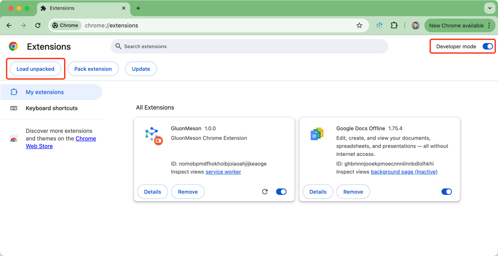
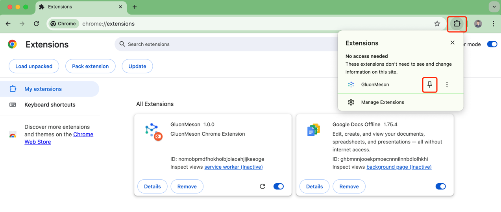

#  GluonMeson Chrome Extension

GluonMeson Chrome Extension is a Chrome Web Browser Copilot, his name is Guru Mason.

## Features

* **Summary**: Quickly grasp the main points of any extensive text with our efficient summarization tool.
* **Ask Page**: Receive answers based on the content of the web page you are currently viewing.
* **Google**: Conduct Google searches right from your browser, ensuring you get the most relevant information swiftly.
* **Translate**: Effortlessly translate content between Chinese and English or into other specified languages.
* **Generate Story**: Automatically create engaging narrative content for new Trello board cards.
* **Generate Text**: Craft specific texts for various purposes, boosting your creativity and efficiency.
* **Generate Tasking**: Generate tasking results based on the description of the trello card you are currently viewing.
* ... and more you can define by yourself!

## Build or Install

### Build from Source Code

1. Run npm install
2. Run build command:
    - Dev: `pnpm dev` or `npm run dev`
    - Prod: `pnpm build` or `npm run build`
3. Follow steps 2 to 5 in [Install from Release file](#install-from-release-file).

### Install from Release file
1. Download & unzip the latest release zip file from [releases page](https://github.com/yingrui/gluonmeson-chrome-extension/releases).
2. Open in browser - `chrome://extensions`
3. Check - `Developer mode`
4. Find and Click - `Load unpacked extension`
5. Select - unzipped file folder or `dist` folder if you build from source code

6. Pin extension in Google Chrome toolbar

### Setup Configurations
Please set up below configurations in the extension popup page: 
* **API Key**: Set api key from OpenAI, Zhipu AI or GluonMeson Platform
* **Base URL**: base url from OpenAI, Zhipu AI or GluonMeson Platform
* **Organization**: Your Organization Name
* **GPT Model**: gpt-3.5-turbo is default
* **Tools Call Model**: recommend gpt-4-turbo or glm-4, if it's empty, will not use tools call to recognize user intents.

Please refer to [How to setup configurations](docs/tutorial/how_to_setup_configurations.md) for more details.

## For Users
For who want to use this extension, please refer to below documents:
* [An Introduction to GluonMeson Chrome Extension](docs/tutorial/an_introduction_to_gluonmeson_chrome_extension.md)
* [How to setup configurations](docs/tutorial/how_to_setup_configurations.md)
* [How to use this chrome extension](docs/tutorial/how_to_use_this_chrome_extension.md)
* [Interesting Use Cases](docs/tutorial/interesting_usecases.md)

## For Developers
For who want to contribute to this extension, please refer to below documents:
* [How to get web page content](docs/tasking/how_to_get_web_page_content.md)
* [How to add new agent and command](docs/tasking/how_to_add_new_agent_and_command.md)
* [How to update popup window for configuration](docs/tasking/how_to_update_popup_window_for_configuration.md)