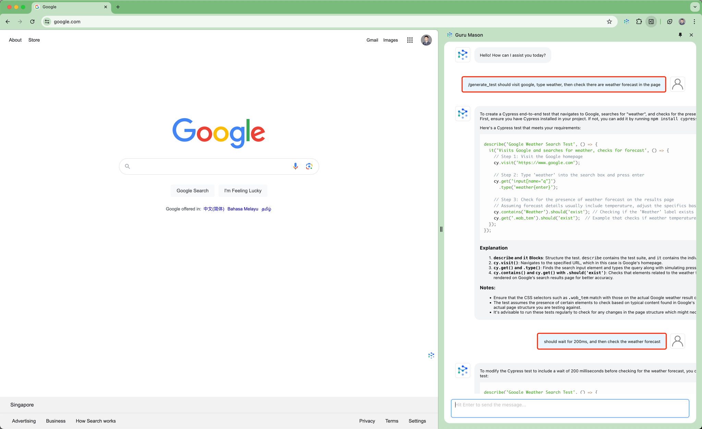
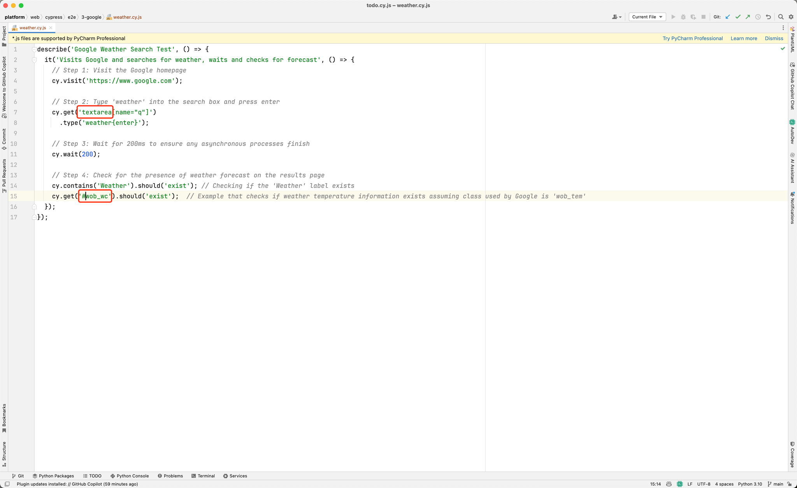
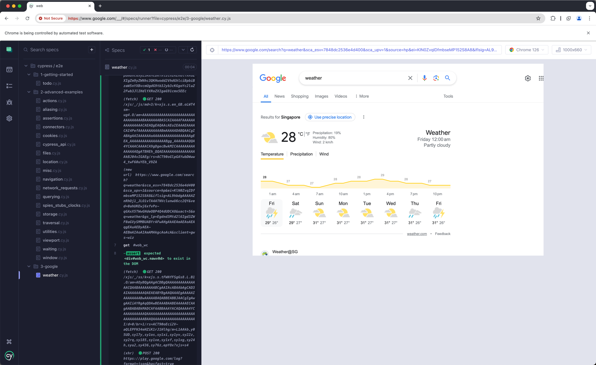

# Develop a E2E Test Generation Tool

If we can develop a tool that can generate E2E test cases for the web application, it will be very helpful for the `junior QA` (senior QAs are able to develop test script by themselves). The tool can be used to generate the test cases for the new feature, and the QA team can modify the test cases according to the actual situation.

## The Use Case

Imagine that you're a new QA in the team, you need to write E2E test cases for the new feature, your team chose the Cypress as the test tool. The problem is that you're not familiar with Cypress, and you're not familiar the html structure as well. 

You looked at the web application the team developed, you imagine if the webpage can tell you how to test itself will be wonderful. Just like this:



Imagine that you're building a weather forecast widget in google search. Above image shows that the browser copilot (Guru Mason) can generate the test cases for you, you can copy the test cases and paste it to the Cypress test file.



There is only two places need to be changed:
1. the generate result is `input[name="q"]`, it needs to be changed to `textarea[name="q"]`.
2. the widget should show in the page, but the element selector is not correct, you need to change it from `.wob_tem` to `#wob_wc`. 

Then the test case would be correct and below is the test result.



## Is it hard to develop such copilot?

If you want to build such copilot from 0 to 1, it will be very hard. You need to know how to develop `Chrome Extension`, and how to build AI agent to generate the test cases, how to provide enterprise-level security and compliance solution, etc.

But based on GluonMeson Chrome Extension, you can easily build such copilot. You just need to develop a new agent and command, then the copilot can generate the test cases for you.

### Add a new agent
Add a new agent to the `src/pages/sidepanel/agents` directory. This agent should declare that it can handle the `generate_test` command in constructor.
```typescript
class UiTestAgent extends AgentWithTools {
  constructor(defaultModelName: string, client: OpenAI, language: string) {
    super(defaultModelName, client, language);
    this.addTool(
      "generate_test",
      "understand user's instruct and generate an E2E test for current viewing webpage",
      ["instruct"],
    );
  }
  ...
```

### Implement the `executeCommand` method
Implement the `executeCommand` method in the agent. The method should take a command and arguments as input and return the result of the command. The method should throw an error if the command is not recognized.
```typescript
async executeCommand(command: string, args: object, messages: ChatMessage[]): Promise<any> {
  switch (command) {
    case "generate_test":
      return this.generate_test(args["instruct"]);
    }
  throw new Error("Unexpected tool call in UiTestAgent: " + command);
}
```

### Implement the `generate_test` method
Implement the `generate_test` method in the agent. The method send `get_html` message to content script, and then fulfill the prompt template. At last, send the prompt to the GPT services and get the generated test.
```typescript
  async generate_test(instruct: string) {
    const page = await get_html();
    if (!page) return this.handleCannotGetHtmlError();

    const prompt = `You're a senior QA engineer and good at cypress e2e test.
The user is viewing webpage: ${page.url} ${page.title}.
Please generate cypress e2e test according to user instruction: ${instruct}
The webpage html is below:
${page.html}`;

    return await this.chatCompletion([
      { role: "system", content: prompt },
      { role: "user", content: `please generate cypress test:` },
    ]);
  }
```

### Tasking
1. Add a new agent to the `src/pages/sidepanel/agents` directory.
2. Implement the `executeCommand` method in the agent.
3. Be able to get html from current page in `generate_test` method.
4. Send prompt to gpt service and get result in `generate_test` method.
5. Add the agent to the agent list in the `AgentFactory` class.
6. Add the `/generate_test` command to the `GluonMesonAgent` commands list.
7. Test the new agent and command in side panel.

All the changes are in this commit: [Add E2E Test Generation Tool `b51555c`](https://github.com/yingrui/gluonmeson-chrome-extension/commit/b51555c2192b2b60a9a01f6466f94a96bb302677)

I spent only 2 hours to develop this feature, there are only 5 files need to be changed or added:
1. `src/pages/sidepanel/agents/UiTestAgent.ts`
2. `src/pages/sidepanel/agents/agents.ts`
3. `src/pages/sidepanel/agents/GluonMesonAgent.ts`
4. `src/pages/sidepanel/utils/index.ts`
5. `src/pages/content/injected/listeners/common/commands.ts`

## Do it yourself
Based on this GluonMeson Chrome Extension, you can easily extend more tools as you wish. For example: 
* **Generate your performance review**, because this copilot can understand your current objectives from your review system. 
* **Generate the SQL** while using superset, because this copilot can understand your metadata from webpage. 
* **Generate Report** for operation & maintenance, because this copilot can get CI/CD logs and understand the error message.
* ... and more you can define by yourself!
