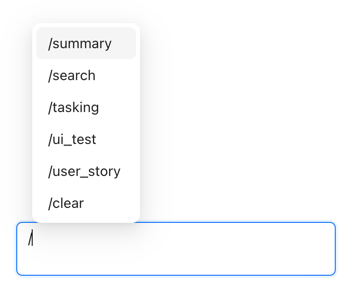
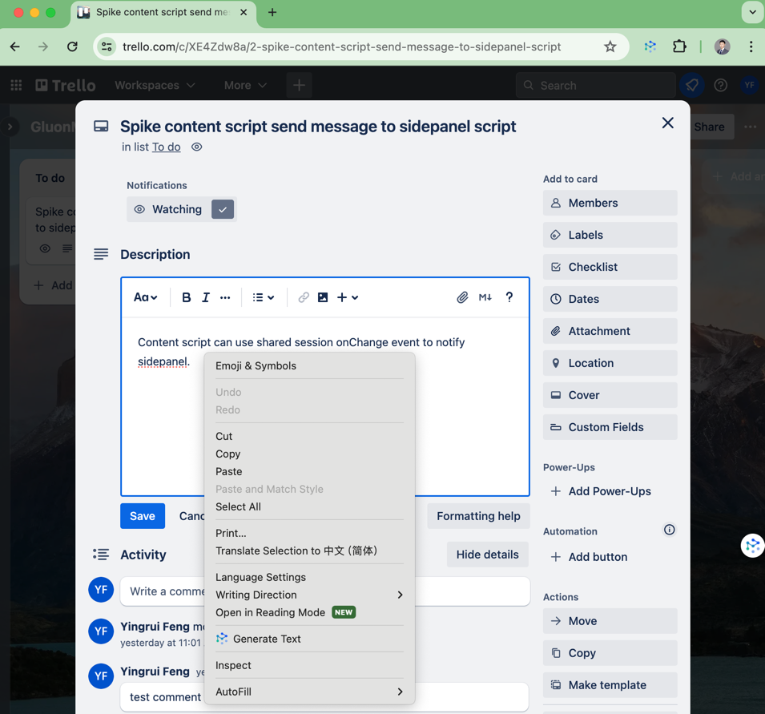

# An Introduction to GluonMeson Chrome Extension

This Chrome extension has been designed to provide a seamless experience for users, offering a range of features to enhance your browsing experience. This document will guide you on how to use the extension effectively.

The interactions with this extension include:

* **Chat in Side Panel**: have a conversation with GluonMesonAgent in the side panel.
* **Right-click**: when you right-click the mouse in webpage, the context menu will showup. Currently, it only supports `Generate Text` action.
* **Shortcut key**: Use `alt + enter` to open side panel. In the future, there will be more shortcuts to trigger new functions.

Before we dive in, let's introduce some concepts in this Chrome extension:

* **Agent**: in this extension, there are many agents with different tools, such as `GluonMesonAgent`, `SummaryAgent`, `GoogleAgent`, `TranslateAgent`, `TrelloAgent`, etc. But you're only have conversation with GluonMesonAgent, this agent will try to understand your intent and then call other agents to help you.
* **Command**: some tools of agent have been set as commands, you can type `/` in the chat box to execute corresponding tools directly.
* **Context Menus**: in Chrome extension, when you right-click the mouse it can provide some quick actions, it is called context menu. This extension provide `Generate Text` action when you are writing in a text area and right-click the mouse.
* **Content Script**: Some actions need to get more details information from webpage, or need to execute automatically in webpage. For example, if you think the generated story is good, then you want to create a Trello card automatically.

## Agents

The `GluonMesonAgent` will try to understand your intent and call the tools provided by other agents. And you can also directly send command to execute. Here are the commands when you type `/` in the chat box, you will see:



Command `/clear` is used to clear the chat history, it does not belong to any agent.

Next, we will introduce the agents and the tools provided by them.

### GluonMesonAgent

The central agent in this extension, GluonMesonAgent is designed to understand your intent and call the tools provided by other agents to help you.

**Supported Command**: Help

Agent has tools as below:

* **Help**: Get help with the available capabilities in the extension.
* **Generate Text**: Craft specific texts for various purposes, boosting your creativity and efficiency. *Note: This command can be triggered by right-clicking in a text area.*

### SummaryAgent

Based on current web page content, SummaryAgent can provide a summary of the text or answer questions related to the content.

**Supported Command**: summary, ask_page

Agent has tools as below:

* **Summary**: Quickly grasp the main points of any extensive text with our efficient summarization tool.
* **Ask Page**: Receive answers based on the content of the web page you are currently viewing.

### GoogleAgent

GoogleAgent allows you to conduct Google searches right from chat box, ensuring you get the most relevant information swiftly.

**Supported Command**: google

Agent has tools as below:

* **Google**: Conduct Google searches right from your browser, ensuring you get the most relevant information swiftly.

### TranslateAgent

TranslateAgent allows you to effortlessly translate conversation information between Chinese and English or into other specified languages.

**Supported Command**: translate

Agent has tools as below:

* **Translate**: Effortlessly translate content between Chinese and English or into other specified languages.

### TrelloAgent

TrelloAgent provides tools to help you to generate stories and breakdown these stories with Trello.

**Supported Command**: generate_story, tasking

Agent has tools as below:

* **Generate Story**: Automatically create engaging narrative content for new Trello board cards.
* **Tasking**: Generate tasking results based on the description of the trello card you are currently viewing.

## Context Menus

When you right-click the mouse in an `editable` text area, the context menu will show up. If you click the action item, then the command will be executed in sidepanel.



Currently, it only supports the `Generate Text` action. But you can add more context menu by yourself, for example:

* When you're read an article, and you don't understand something, then you can selected the text in the webpage, you can click the `explain` context menu. Which is a new functionality you can contribute.

## Content Scripts

Some actions need to get more details information from the webpage, or need to execute some actions automatically in the webpage. So we need use the content scripts to achieve this, and it could be extended in the future.

For example, there is the `get_content` message, and this extension can send this message to get the webpage content and then generate a summary or ask questions.

This is an example of content script, which can help us to get the content of the webpage:
```typescript
chrome.runtime.onMessage.addListener((message, sender, sendResponse) => {
  (async () => {
    if (message.type === "get_content") {
      sendResponse({
        title: document.title,
        text: document.body.innerText,
        url: document.URL,
      });
    }
  })();
});
```

## Conclusion

This Chrome extension is designed to provide a seamless experience for users, offering a range of features to enhance your browsing experience. By following the steps outlined in this document, you can make the most of the extension's capabilities and enjoy a more efficient and productive browsing experience. If you have any questions or need further assistance, please feel free to reach out to us. We are here to help you make the most of this extension and ensure you have a positive experience. Happy browsing!
