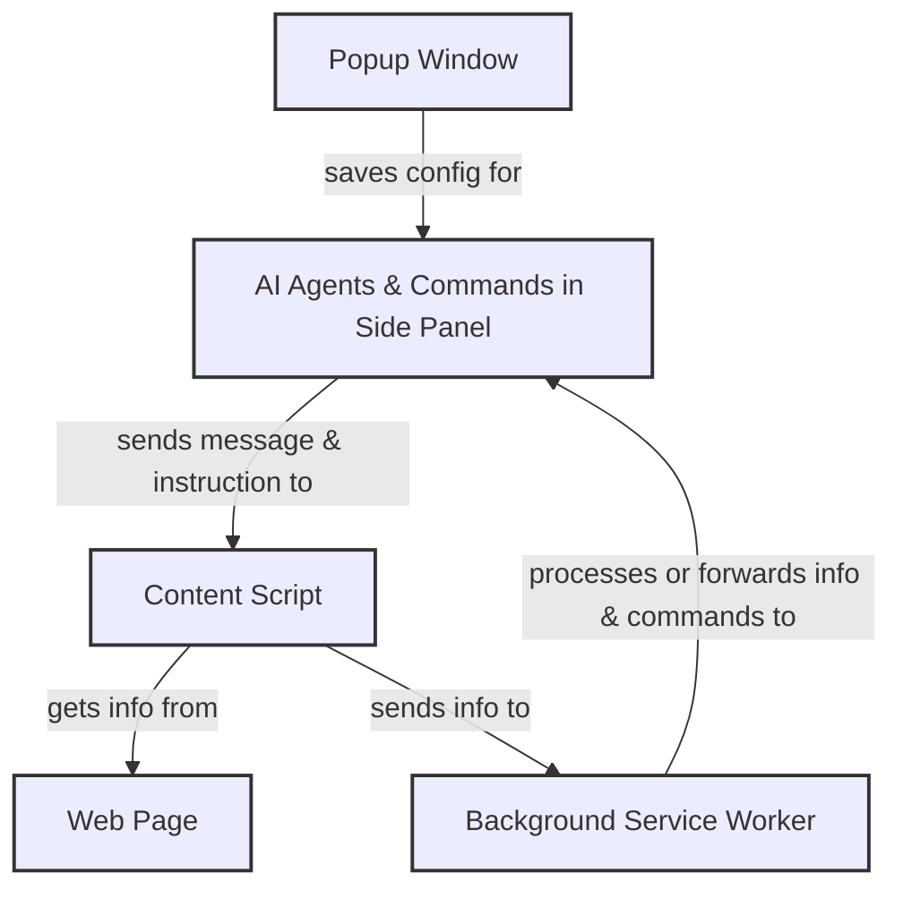
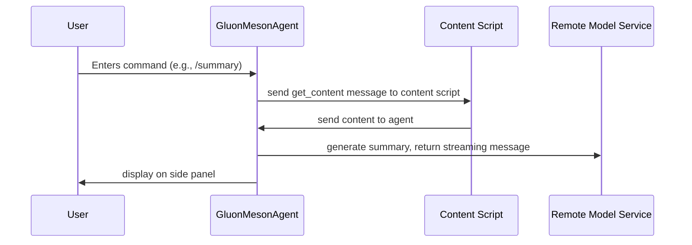
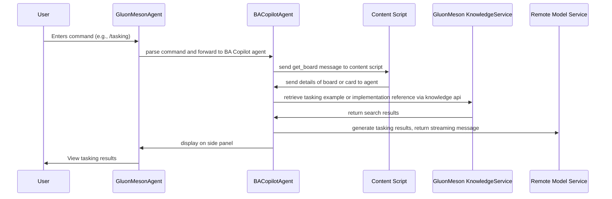

# An Introduction to GluonMeson Chrome Extension

This Chrome extension has been designed to provide a seamless experience for users, offering a range of features to enhance your browsing experience. This document will guide you on how to use the extension effectively.

The interactions with this extension include:

* **Chat in Side Panel**: This is a conversation UI extension, you can have a conversation with GluonMesonAgent in the side panel. 
* **Right-click**: when you right-click the mouse in webpage, the context menu will showup. Currently, it only supports `Generate Text` action.
* **Shortcut key**: Use `alt + enter` to open side panel. In the future, there will be more shortcuts to trigger new functions.

Before we dive in, let's introduce some concepts in this Chrome extension:

* **Popup Window**: Manages additional settings and can save configurations specifically for the agent operations within the Side Panel.
* **Agents & Commands**: in this extension, there are many agents with different tools, such as `GluonMesonAgent`, `SummaryAgent`, `GoogleAgent`, `TranslateAgent`, `TrelloAgent`, etc. These agents are packed in side panel, the agent can recognize your intent and then call other agents to help you. Some tools of agent have been set as commands, you can type `/` in the chat box to execute corresponding tools directly.
* **Side Panel**: the side panel is used to chat with GluonMesonAgent, and it will show the results of the tools you executed. All the results will be displayed in Markdown format. Other agents do not need to write code for displaying.
* **Context Menus**: in Chrome extension, when you right-click the mouse it can provide some quick actions, it is called context menu. This extension provide `Generate Text` action when you are writing in a text area and right-click the mouse.
* **Content Script**: Some actions need to get more details information from webpage, or need to execute automatically in webpage. For example, if you think the generated story is good, then you want to create a Trello card automatically.
* **Background Service Worker**: Extension service workers are an extension's central event handler, it is processing layer that manages interactions and data flow between the Content Script and the Side Panel.



## 1. Agents & Commands

The `GluonMesonAgent` will try to understand your intent and call the tools provided by other agents. And you can also directly send command to execute. Here are the commands when you type `/` in the chat box, you will see:


Command `/clear` is used to clear the chat history, it does not belong to any agent.

Next, we will introduce the agents and the tools provided by them.

### 1.1. GluonMesonAgent

**Agent Name**: Guru, your browser assistant.

This is a composite agent in this extension. GluonMesonAgent is designed to understand your intent and call the tools provided by other agents to help you.
And it also can provide a summary of the text or answer questions related to the current web page.

**Supported Command**:
* **Implemented Command**: summary
* **Delegate Command**: search, tasking, ui_test, user_story

This agent implements tools as below:

* **Summary**: Quickly grasp the main points of any extensive text with our efficient summarization tool.
* **Generate Text**: Craft specific texts for various purposes, boosting your creativity and efficiency. *Note: This command can be triggered by right-clicking in a text area.*

The sequence diagram for the `/summary` command:


### 1.2. SearchAgent

**Agent Name**: Seeker, your search assistant.

SearchAgent allows you to search content from `DuckDuckGo` or use Google to search information from side panel.

**Supported Command**: search

Agent has tools as below:

* **Google**: Open Google search page from your browser.
* **Search**: Search information from `DuckDuckGo`.
* **Open Url**: Based on your command, open url showing in conversation.

### 1.3. TranslateAgent

**Agent Name**: Translator, your translation assistant.

TranslateAgent allows you to effortlessly translate conversation information between Chinese and English or into other specified languages.

**Supported Command**: translate

Agent has tools as below:

* **Translate**: Effortlessly translate content between Chinese and English or into other specified languages.

### 1.4. BACopilotAgent

**Agent Name**: BACopilot, your BA assistant.

BACopilotAgent provides tools to help you to generate stories and breakdown these stories with story board.

**Supported Command**: user_story, tasking

Agent has tools as below:

* **User Story**: Automatically create engaging narrative content for new Trello board cards.
* **Tasking**: Generate tasking results based on the description of the trello card you are currently viewing.

The sequence diagram for the `/tasking` command:


## 2. Side Panel

When the first time you installed the extension, after you open a new tab or refresh the current tab, there are multiple ways to open the side panel.

### 2.1. Floating Ball

You will see the floating ball on the right side of the webpage, you can click it to open side panel, then you can chat with GluonMesonAgent.


If it doesn't work, please refresh the webpage or reload the extension.


The floating ball is implemented in content script, and it can open side panel by sending a message to the background service worker. The code is like this:
```typescript
// in content script
chrome.runtime.sendMessage({ type: "open_side_panel" });

// in background service worker
chrome.runtime.onMessage.addListener((message, sender) => {
  (async () => {
    if (message.type === "open_side_panel") {
      await chrome.sidePanel.open({ tabId: sender.tab.id });
    }
  })();
});
```

### 2.2. Shortcut Key

You can type `alt + enter` to open the side panel. If it doesn't work, please refresh the webpage or reload the extension.

This is also implemented in content script, and it can open side panel by sending a message to the background service worker:
```typescript
document.addEventListener("keydown", (event) => {
  if (event.altKey && event.key === "Enter") {
    chrome.runtime.sendMessage({ type: "open_side_panel" });
  }
});
```

### 2.3. Click the Toolbar to Open Side Panel

You can click the extension icon in the toolbar to open the side panel. In this way, you need click 3 times to open the side panel.


## 3. Context Menus

When you right-click the mouse in an `editable` text area, the context menu will show up. If you click the action item, then the command will be executed in sidepanel.


Currently, it only supports the `Generate Text` action. But you can add more context menu by yourself, for example:

* When you're read an article, and you don't understand something, then you can selected the text in the webpage, you can click the `explain` context menu. Which is a new functionality you can contribute.

## 4. Content Scripts

Some actions need to get more details information from the webpage, or need to execute some actions automatically in the webpage. So we need use the content scripts to achieve this, and it could be extended in the future.

For example, there is the `get_content` message, and this extension can send this message to get the webpage content and then generate a summary or ask questions.

This is an example of content script, which can help us to get the content of the webpage:

```typescript
chrome.runtime.onMessage.addListener((message, sender, sendResponse) => {
  (async () => {
    if (message.type === "get_content") {
      sendResponse({
        title: document.title,
        text: document.body.innerText,
        url: document.URL,
      });
    }
  })();
});
```

## 5. Conclusion

This Chrome extension is designed to provide a seamless experience for users, offering a range of features to enhance your browsing experience. By following the steps outlined in this document, you can make the most of the extension's capabilities and enjoy a more efficient and productive browsing experience. If you have any questions or need further assistance, please feel free to reach out to us. We are here to help you make the most of this extension and ensure you have a positive experience. Happy browsing!
