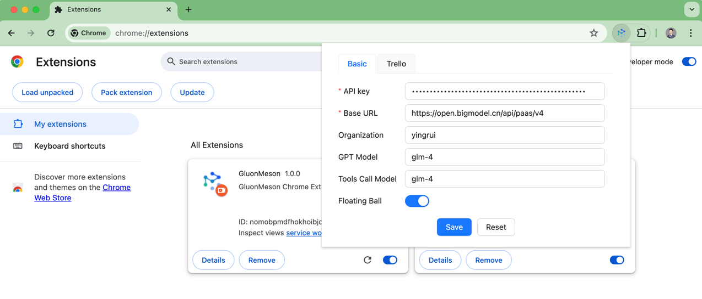
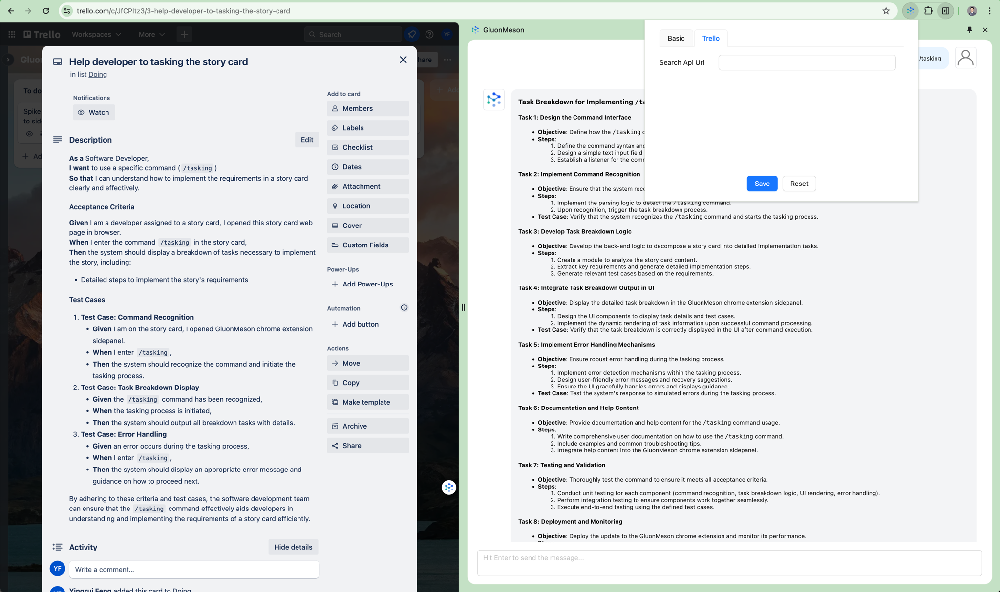
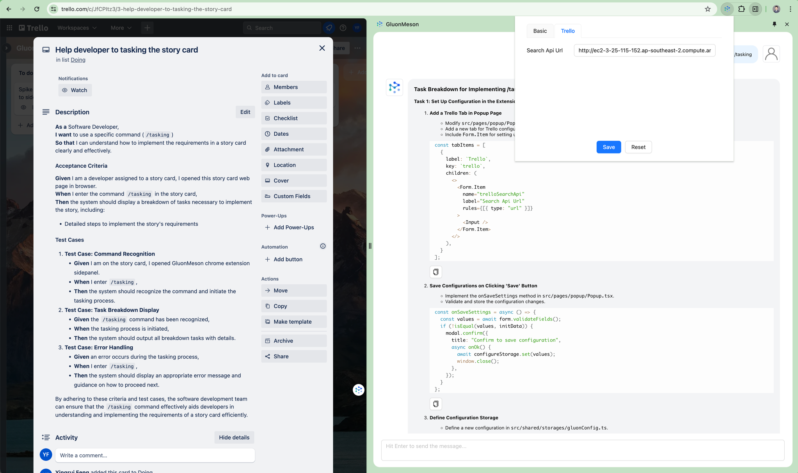

# Set up Configurations
The GluonMeson Chrome Extension can be configured with [OpenAI](https://platform.openai.com/docs/overview), [Zhipu.AI](https://open.bigmodel.cn/dev/api), or GluonMeson (thoughtworks GenAI platform). This document will guide you on how to set up configurations in the extension popup page.

## Basic Configurations
As shown in the image below, you can set up the following configurations in the extension popup page:

Above image shows the example configurations with Zhipu.AI:
* **API Key**: The API Key is from Zhipu.AI
* **Base URL**: Base url is Zhipu.AI, please check [docs](https://open.bigmodel.cn/dev/api#glm-4) to get Request URL, and notice that the base url needs to remove the `/chat/completions` at the end. Because the sdk will add it automatically.
* **Organization**: Optional configuration in OpenAI client. For Zhipu.AI, this configuration is useless. In GluonMeson Platform, this configuration could be used to identify the teams or use cases.
* **GPT Model**: For Zhipu.AI, you could choose glm-4 or glm-3-turbo
* **Tools Call Model**: For Zhipu.AI, you could choose glm-4 or glm-3-turbo. This configuration is optional, if it's empty, will not use tools call to recognize user intents.

| Configuration   | Mandatory | OpenAI                    | Zhipu.AI                             | GluonMeson                                               |
|-----------------|-----------|---------------------------|--------------------------------------|----------------------------------------------------------|
| API Key         | ✅        | Provide key by yourself   | Provide key by yourself              | Create your own key in your environment                  |
| Base URL        | ✅        | https://api.openai.com/v1 | https://open.bigmodel.cn/api/paas/v4 | on-premise deploy environment                            |
| Organization    | ✅        | Optional                  | Not used                             | Used for auditing                                        |
| GPT Model       | ✅        | gpt-3.5-turbo             | glm-4 or glm-3-turbo                 | most cloud services & local deployed open sourced models |
| Tools Call Model| ✅        | gpt-4-turbo               | glm-4                                | depends on supported models                              |

* **Floating Ball**: If it's true, then there will be a floating ball to trigger the extension popup window.

## Other Configurations Tabs

### Trello Tab
If you need to add more configurations, you can add a new tab popup window. For example, there is a Trello tab in the popup page.

#### Usecase 
When developer try to break down the story in the trello card, they can use the extension to generate the tasking result.

#### Problem
The LLM models don't know the details of your project, so the generated tasking result may not be useful.

#### Solution
If you can provide an API to get some tasking examples of the project, then the generate tasking result will be more useful.

#### Search API
You can find out all the tasking examples are in the `docs/tasking` folder. if you can import them to GluonMeson knowledge base, and create a semantic search api. 

Then you need let Agent know this search api url, and then use this API to get the tasking examples.

***Note:*** *The Search Api Url configurations only support when you have GluonMeson deployed in your environment.*

*If there is no tasking example, then the generate tasking result will be less useful.*

*If there are tasking examples, then the generate tasking result will be very useful.*

You can check the [How to add new agent and command](../tasking/how_to_add_new_agent_and_command.md) to see how useful are the tasking results for the software engineer.