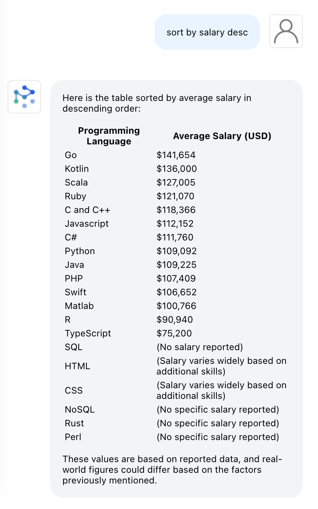
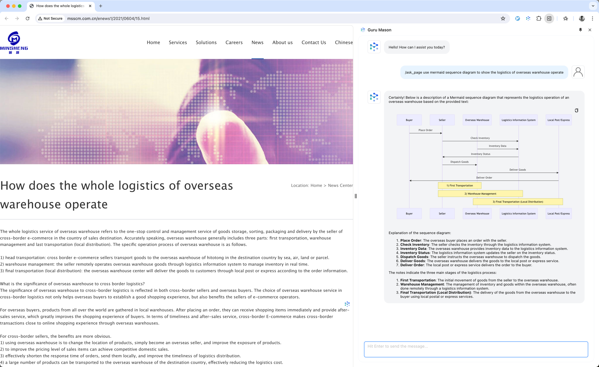
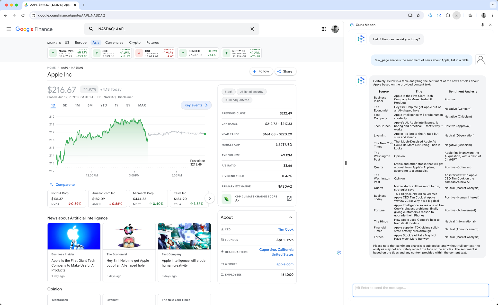
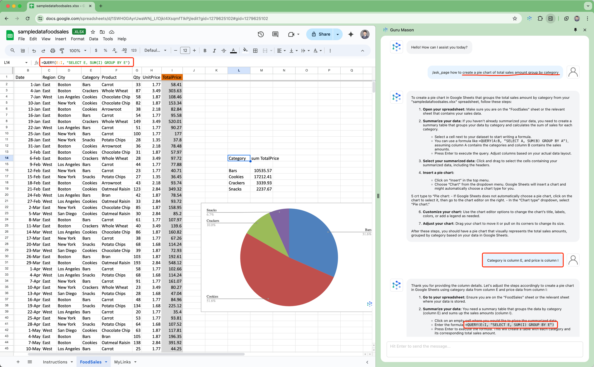

# Interesting Use Cases
There are many interesting use cases for the GluonMeson Chrome extension. In this document, we will explore some of the most common and useful use cases for the extension, including information extraction and business analysis. By following the steps outlined in this document, you can make the most of the extension's capabilities and enjoy a more efficient and productive browsing experience.

## Use Cases Categories

### 1. Information Extraction

#### 1.1 List Programming Languages and Average Salary
When you're doing research on software engineer, and you find out some webpage listed the popular programming languages and their average salary, you can use the `/ask_page` command to extract the table data.

You can try sorting the table by chat with the agent.

### 2. Business Analysis

#### 2.1 Learn Overseas warehouse operation process
When you're investigating overseas warehouse operation process flow, you can use the `/ask_page` command to draw the flow in mermaid format.

#### 2.2 Sentiment analysis for company news
When you're analyzing the sentiment of company news, you can use the `/ask_page` command to extract the news content and analyze the sentiment.

### 3. Data Analysis

#### 3.1 Data Visualization in Spreadsheet
When you're analysis data in google spreadsheet, and you don't know how to insert chart, you can use the `/ask_page` command to ask Guru Mason.

In this case, many users may don't the formula `=QUERY(E:I, "SELECT E, SUM(I) GROUP BY E")` before. Guru Mason can help you to learn new formula.